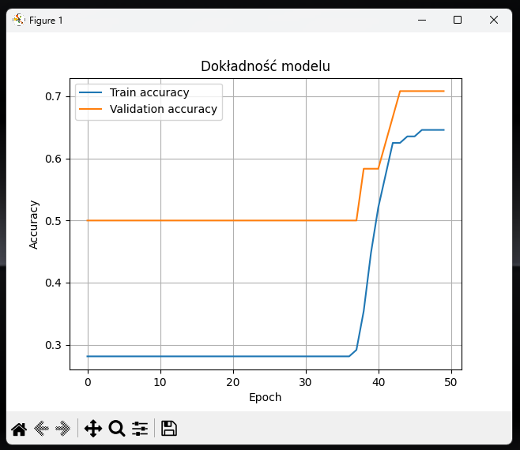
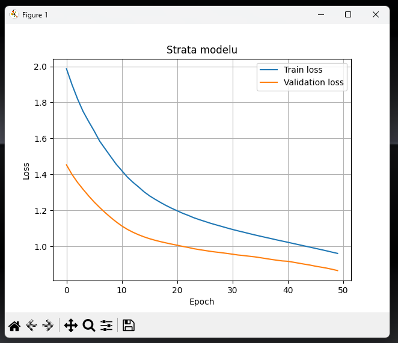
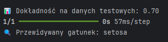

<h1 align="center"> Klasyfikator Kwiatów Iris w TensorFlow</h1>

Ten projekt to prosty i funkcjonalny **klasyfikator gatunków kwiatów Iris** stworzony z użyciem sieci neuronowych (TensorFlow/Keras). Wykorzystuje znany zbiór danych Iris do trenowania modelu, który przewiduje gatunek na podstawie cech takich jak długość i szerokość działek kielicha oraz płatków. Projekt zawiera podział na moduły odpowiedzialne za wczytywanie danych, budowę modelu, trening, ewaluację oraz predykcję. Przewidziano również integrację z TensorBoardem w celu monitorowania procesu uczenia.

---

##  Technologie i środowisko

- **Język:**  [](https://docs.python.org/3/) 
- **Środowisko IDE:** [](https://www.jetbrains.com/pycharm/)  
- **Biblioteki:**  
  - [](https://www.tensorflow.org/learn) – budowa i trening modelu neuronowego  
  - `scikit-learn` – ładowanie zbioru danych Iris, podział na zbiór treningowy i testowy, kodowanie etykiet  
  - `NumPy` – przygotowanie danych wejściowych do predykcji  
  - `pandas` – przekształcenie zbioru danych na DataFrame  
  - `matplotlib` – wizualizacja dokładności i strat modelu  
  - `datetime` – generowanie unikalnych ścieżek logów  
  - `os` – obsługa logów i katalogów (pośrednio przez TensorFlow)  

---
<details>
  <summary> Funkcje programu (kliknij, aby rozwinąć)</summary>

---

<details>
  <summary>📄 <strong><span style="color:#4a90e2">load_data.py</span></strong> – przygotowanie danych (kliknij, aby rozwinąć)</summary>

Ten moduł odpowiada za przygotowanie zbioru danych do treningu:

- **`get_data()`**  
  Główna funkcja:
  - Wczytuje zbiór Iris z `sklearn.datasets.load_iris()`.
  - Tworzy `DataFrame` z kolumnami cech i etykietą „species”.
  - Zamienia indeksy klas (0, 1, 2) na etykiety tekstowe (np. *setosa*).
  - Koduje etykiety do wartości numerycznych za pomocą `LabelEncoder`.
  - Dzieli dane na `train/test` za pomocą `train_test_split()`.

Zwracane dane:
```python
X_train, X_test, y_train, y_test, encoder
```

</details>

---

<details>
  <summary>📄 <strong><span style="color:#7b8d8e">build_model.py</span></strong> – konstrukcja modelu (kliknij, aby rozwinąć)</summary>

Moduł zawiera funkcję:

- **`build_model()`**
  - Tworzy model sekwencyjny `tf.keras.Sequential` z 3 warstwami:
    - 2 warstwy ukryte z 10 neuronami i aktywacją `relu`.
    - 1 warstwa wyjściowa (3 klasy) z `softmax`.
  - Kompiluje model z:
    - Optymalizatorem `adam`
    - Funkcją straty: `sparse_categorical_crossentropy`
    - Metryką: `accuracy`

Zwraca gotowy do treningu obiekt modelu `tf.keras.Model`.

</details>

---

<details>
  <summary>📄 <strong><span style="color:#9b59b6">train.py</span></strong> – trenowanie i wizualizacja (kliknij, aby rozwinąć)</summary>

- **`train_model(model, X_train, y_train)`**  
  Funkcja realizująca:
  - Trening modelu przez 50 epok z walidacją (`validation_split=0.2`).
  - Konfigurację **TensorBoard** z dynamiczną nazwą folderu (`logs/fit/YYYYMMDD-HHMMSS`).
  - Rejestrowanie logów do plików `.tfevents...`.

✅ Wykresy generowane przez `matplotlib`:
- Dokładność (`accuracy`, `val_accuracy`)
- Strata (`loss`, `val_loss`)

Funkcja zwraca obiekt `history` (dane do dalszej analizy wyników).

</details>

---

<details>
  <summary>📄 <strong><span style="color:#2ecc71">evaluate.py</span></strong> – ocena modelu (kliknij, aby rozwinąć)</summary>

- **`evaluate_model(model, X_test, y_test)`**  
  - Wykonuje ewaluację modelu na zbiorze testowym.
  - Zwraca metryki `loss` i `accuracy`.
  - Wynik jest wypisywany w czytelnej formie z dokładnością do 2 miejsc po przecinku.

</details>

---

<details>
  <summary>📄 <strong><span style="color:#e67e22">predict.py</span></strong> – klasyfikacja nowych próbek (kliknij, aby rozwinąć)</summary>

- **`predict_species(model, encoder, input_data)`**  
  - Przygotowuje dane wejściowe (`np.array([[...]])`).
  - Używa modelu do predykcji (`model.predict()`).
  - Wybiera indeks największego prawdopodobieństwa (`tf.argmax()`).
  - Dekoduje etykietę gatunku za pomocą `encoder.inverse_transform()`.

Funkcja wyświetla komunikat z nazwą przewidzianego gatunku (`Iris-setosa`, `Iris-versicolor`, `Iris-virginica`).

</details>

---

<details>
  <summary>📄 <strong><span style="color:#c0392b">main.py</span></strong> – główny punkt startowy programu (kliknij, aby rozwinąć)</summary>

- Funkcja `main()` uruchamia cały pipeline:
  1. Załadowanie i przygotowanie danych (`get_data`)
  2. Budowa modelu (`build_model`)
  3. Trening (`train_model`)
  4. Ewaluacja (`evaluate_model`)
  5. Predykcja przykładowej próbki (`predict_species`)

Skrypt jest gotowy do uruchomienia przez terminal lub PyCharma:
```python
if __name__ == "__main__":
    main()
```

</details>

---

<details>
  <summary>📄 <strong><span style="color:#34495e">dnn_estimator_iris.py</span></strong> – uproszczony skrypt all-in-one (kliknij, aby rozwinąć)</summary>

Ten plik zawiera:
- Jednoetapowy pipeline w jednym skrypcie (bez modularnego podziału).
- Przykład zbudowania modelu `Sequential` z większą liczbą neuronów.
- Trenowanie i walidacja przez 50 epok.
- Predykcję próbki `np.array([[5.1, 3.5, 1.4, 0.2]])`.

Użyte narzędzia:
- `LabelBinarizer` zamiast `LabelEncoder`
- `categorical_crossentropy` (zamiast sparse)

Plik przydatny jako demo lub sandbox do eksperymentów.

</details>

---

<details>
  <summary>🧰 <strong>Instalacja i uruchomienie – wymagane komendy (kliknij, aby rozwinąć)</strong></summary>

Aby uruchomić projekt lokalnie, należy wykonać następujące kroki:

1. **Utworzenie wirtualnego środowiska (opcjonalnie):**
```bash
python -m venv .venv
source .venv/bin/activate     # Linux/macOS
.venv\Scripts\activate      # Windows
```

2. **Instalacja zależności:**
```bash
pip install tensorflow scikit-learn pandas matplotlib
```

3. **(Opcjonalne) Uruchomienie TensorBoarda:**
```bash
tensorboard --logdir=logs/fit
```

4. **Uruchomienie programu:**
```bash
python main.py
```

</details>
</details>

---

<details>
  <summary> Podgląd działania (kliknij, aby rozwinąć)</summary>

Poniżej przykładowe wyniki działania programu:

  



</details>
